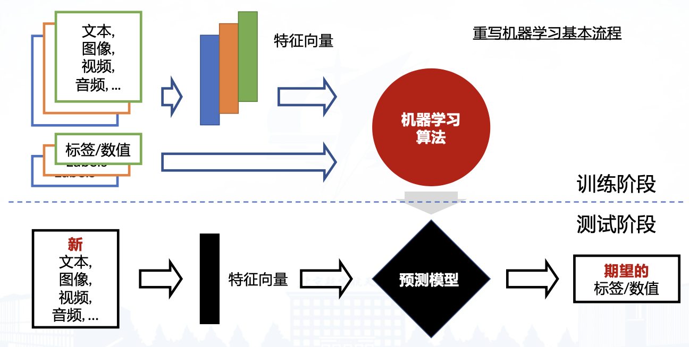
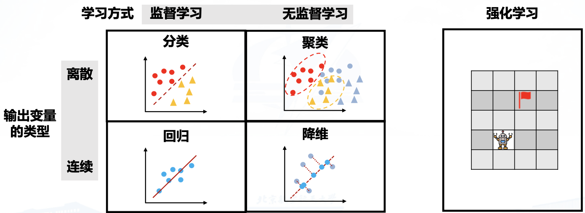

# 1.1 课程的基本信息

## 课程介绍

### 内容安排

- 介绍机器学习的基本概念、发展历程与前沿进展
- 讲述机器学习的经典算法，包括基本思想、建模与优化过程及相关示例
- 结合实际场景，强化机器学习方法与技术的应用

### 先修课程

- 线性代数、概率统计
- 程序设计语言

# 1.2 什么是机器学习

## 机器学习的定义

学习指人在生活过程中，通过**获得经验而产生的行为或行为潜能**的相对持久的行为方式。

机器学习研究计算机如何模拟或实现人类的学习行为。

### 机器学习

- Arthur Samuel（1956）：通过不显式编程赋予计算机学习能力的研究
- Tom Mitchell（1998）：程序完成任务 T 时，经经验 E 后性能度量 P 提升，则称其从 E 中学习
- 统计视角：未知量视为随机变量，用概率分布建模不确定场景的决策，是跨学科通用语言

统计建模是在存在不确定情况时进行决策制定的最优方法，概率建模是科学与工程领域中大多数分支所使用的通用语言，因此可以为机器学习和这些领域提供一个统一框架。

### 机器学习和人工智能

机器学习是人工智能的**核心分支与关键实现手段**，人工智能是更宏观的领域（目标是让机器具备智能），机器学习通过数据驱动的学习方法（无需显式编程），为人工智能的落地提供核心技术支撑（如算法模型、泛化能力提升）。

人工智能除了包括机器学习，还包括专家系统、基于语法规则的自然语言处理、传统计算机视觉方法、决策与规划等。

深度学习是机器学习的子分支。

## 机器学习的发展历程

### 早期探索阶段（1943-1970s）

奠定机器学习理论与技术雏形，人工神经网络、感知机、图灵测试等核心基础相继出现，为后续发展铺路。

- 1943 年：W. McCulloch 和 W. Pitts 提出**人工神经网络（ANN）**，模拟大脑信息处理，奠定连接主义基础
- 1949 年：D. Hebb 提出**赫布理论**，揭示神经元连接强度规律，成为神经网络算法核心原理
- 1950 年：A. Turing 提出**图灵测试**，为 AI 设定早期智能判断标准
- 1952 年：A. Samuel 开发首个自我学习跳棋程序，推翻 "机器无法超越人类" 认知
- 1957 年：F. Rosenblatt 提出**感知机模型**，为神经网络与深度学习奠基
- 1970 年代：吴文俊提出 "吴方法"，推动符号主义自动推理与符号计算发展

### 统计学习阶段（1970s-2000s）

以反向传播算法、支持向量机、决策树为核心，统计方法成为主流，推动机器学习走向实用化。

- 1974 年：P. Werbos 提出**多层感知机与反向传播（BP）算法**，为深度学习训练奠定基础
- 1970-1990 年代：J. Hopfield 提出**Hopfield 网络**，R. Quinlan 等人完善**决策树算法**（规则清晰，广泛应用）
- 1985-1986 年：D. Rumelhart、G. Hinton 等推广**反向传播算法**，成为神经网络训练标准方法
- 1989 年：Y. LeCun 提出**LeNet-5**，首个卷积神经网络（CNN），标志计算机视觉雏形
- 1995 年：V. Vapnik 提出**支持向量机（SVM）**，成为该阶段主流算法，与神经网络形成两大流派

### 深度学习阶段（2000s-2022）

依托深层神经网络、GPU 计算与大数据，AlexNet、Transformer 等技术突破，实现计算机视觉与自然语言处理领域革命性进展。

- 2006 年：G. Hinton 提出**深度信念网络**，开启深度学习快速发展
- 2009 年：李飞飞发布**ImageNet 数据集**（1400 万张图），为深度学习提供数据支撑
- 2012 年：G. Hinton 团队提出**AlexNet**，以 "深度神经网络 + GPU" 范式获 ImageNet 冠军，推动深度学习普及
- 2014 年：L. Goodfellow 提出**生成对抗网络（GAN）**，谷歌发布**FaceNet**（超人类面部识别精度）
- 2015 年：何恺明提出**残差网络（ResNet）**，解决深层网络梯度消失问题
- 2016 年：DeepMind 的**AlphaGo**击败围棋世界冠军，**AlphaGo Zero**通过自我对弈学习，展示强化学习潜力
- 2017 年：谷歌提出**Transformer 模型**，变革深度学习方向，奠定生成式 AI 基础
- 2018 年：BERT、GPT、T5 等**预训练语言模型**问世，推动自然语言处理突破

### 大模型阶段（2022-）

以千亿级参数、多模态能力为特征，ChatGPT 等大模型问世，推动跨学科融合与通用智能雏形显现，开启广泛应用新阶段。

- 2022 年 11 月：OpenAI 发布**ChatGPT**，标志大模型时代到来
- 2023 年：OpenAI 发布**GPT-4**（多模态）、**GPT-4 Turbo**；Meta 开源**LLaMA**（轻量多语言），谷歌发布**Gemini**（多模态），百度发布**文心一言**（中文语境），阿里发布**通义千问**（商业场景），Stability AI 发布**Stable Diffusion**（图片生成）
- 2024 年：OpenAI 发布**Sora**（视频生成），谷歌、宇树等发布**具身智能大模型**（结合机器人）
- 核心趋势：数据量（PB 级）与模型参数（千亿级）增长，泛化能力提升，跨学科融合（AI4Science、药物设计等）

### 发展

- 数据量和模型体积持续增长：数十 MB 的数据到 PB 级数据，参数规模也达到上千亿
- 模型泛化性能逐步提升：GPT 等通用模型
- 跨学科融合与应用扩展

**理论原始创新**是机器学习领域的核心驱动力，算法的突破可以引领一个阶段的发展，对推动AI技术的长远进步和广泛应用具有不可替代的重要价值。

机器学习的发展过程中经历了数次起伏与转折，要站在历史观角度从辩证唯物主义的视角看待技术发展及其局限性。

# 1.3 基本概念和问题

## 基本流程

图为监督学习的基本流程，无监督学习没有“标签/数值”。

## 数据和特征

### 数据

- 模型学习的原始素材，是承载信息的基础载体（如 MNIST 手写体图像、邮件文本、气象记录等）
- 需满足**独立同分布**（训练集与测试集从同一概率分布采样）；原始数据（如图像像素、音频波形）通常难以直接被模型学习
- 分为训练集（用于模型训练）和测试集（用于性能评估）；监督学习中含样本 + 标签，无监督学习中仅含样本

### 特征

- 从概念层面精准、高效描述样本的关键信息，是原始数据的 “结构化转化形式”。
- 可被模型直接学习，无需保证人类可解释性；能提炼原始数据的核心规律（如鱼的长度、图像的纹理特征）。
- 以特征向量形式存在（如 `f = [length, lightness, width, ...]`），维度由描述样本的关键维度决定。

## 机器学习的主要问题

还包括多标签学习、多任务学习、迁移学习、联邦学习、元学习、上下文学习等。

# 1.4 训练目标和评估

## 机器学习的目标

### 监督学习的目标

回归任务最小化均方误差，分类任务最小化错误率。

#### 均方误差（MSE）

$$ \text{均方误差} = \frac{1}{N} \sum_{n=1}^{N} \left( y_n - g(x_n) \right)^2 $$

- $y_n$：真实标签
- $g(x_n)$：模型预测值
- $N$：样本总数

#### 错误率

$$ \text{错误率} = \frac{1}{N} \sum_{n=1}^{N} \mathbb{I}(y_n \neq g(x_n)) $$

- $\mathbb{I}(\cdot)$：指示函数（括号内为真时取1 否则取0）
- $y_n$：真实类别标签
- $g(x_n)$：模型预测类别
- $N$：样本总数

### 无监督学习的目标

最小化量化误差、最小化平均距离，最大化似然，最大化后验概率等。

## 过拟合问题

### 概念

#### 欠拟合

模型复杂度低，不足以拟合数据。

- 训练误差高、测试误差高
- 高偏差，低方差

#### 过拟合

随着模型复杂度升高，训练集上误差减小，测试集上误差增大，过度捕获训练数据中噪声或偶然特征，而非内在规律。

- 训练误差低、测试误差高
- 高方差、低偏差

### 泛化误差

$$\mathbb{E}(f; D) = noise^2 + bias^2(x) + var(x)$$

- $noise$：数据采集过程中出现的随机且不可控的误差，属于不可约误差，无法通过模型优化消除
- $bias$：模型偏差，通常是由于错误的假设或前提导致
- $var$：模型方差，通常是由于不同训练样本的方差导致

$$E_{out}(g) \leq E_{in}(g) \pm \mathcal{O}\left(\sqrt{\frac{d_{vc}}{N} \ln N}\right)$$

- $E_{out}(g)$：模型在未知样本（测试集）上的误差，即泛化误差的核心体现
- $E_{in}(g)$：模型在训练样本上的误差
- $d_{vc}$：VC维，是衡量模型复杂度的指标，模型越复杂，$d_{vc}$越大
- $N$：训练样本的数量
- $\mathcal{O}(\cdot)$：表示“阶数”，此处用于描述训练误差与测试误差之间差距的上界范围

训练误差与测试误差的差距（即泛化误差的波动范围），由**模型复杂度（$d_{vc}$）**和**训练样本数量（$N$）**共同决定，当训练样本数量$N$增大时，$\sqrt{\frac{d_{vc}}{N} \ln N}$项会逐渐减小，意味着训练误差与测试误差的差距缩小。

若模型复杂度（$d_{vc}$）较高，需要更多的训练样本$N$，才能让误差差距缩小，否则易出现过拟合（训练误差小但测试误差大）。

### 成因分析

####  偏差

度量了在训练集/学习算法的期望预测与真实结果的偏离程度，刻画了**学习算法本身的拟合能力**。

$$bias^2(x)=(\overline{f}(x)-y)^2$$ $$\overline{f}(x)=\mathbb{E}_{D}[f(x;D)]$$

- $\overline{f}(x)$：基于不同训练集$D$得到的模型预测值$f(x;D)$的期望，反映模型在不同训练集上对输入$x$预测的平均水平
- $f(x;D)$：基于特定训练集$D$训练得到的模型，对输入$x$的预测值
- $y$：输入$x$对应的真实结果
- $\mathbb{E}_D$：数学期望符号，下标$D$表示对所有可能的训练集$D$（均来自同一数据分布）求期望

#### 方差

度量同样大小的训练集变动所导致的学习性能的变化，刻画了**数据扰动造成的影响**。

$$var(x)=\mathbb{E}_{D}[(f(x;D)-\overline{f}(x))^2]$$

- $var(x)$：输入$x$对应的模型方差
- $\overline{f}(x)$、$f(x;D)$、$\mathbb{E}_D$含义与偏差公式中一致，分别为期望预测值、特定训练集下的预测值、对训练集$D$求期望

### “没有免费的午餐”定理

> All models are wrong, but some models are useful.

- 不存在能对所有类型问题都实现最优的单一最佳模型
- 在某一领域效果很好的一组假设（也称为**归纳偏置**），在另一领域可能效果很差
- 选择合适模型的最佳方式是基于**领域知识**或通过**试错法**

### 正则化

正则化考虑引入和模型或任务相关的先验知识改善训练。

以监督学习中的回归任务（如多项式曲线拟合）为例，正则化后的损失函数通常为：

$$E_{reg}(w) = E_{in}(w) + \lambda \cdot \|w\|^2$$

- $E_{in}(w)$：原始的训练损失函数（如均方误差 $E_{in}(w)=\frac{1}{N}\sum_{n=1}^N (y_n - g(x_n))^2$）
- $\lambda$：正则化系数（控制惩罚项的强度，$\lambda \geq 0$）
- $\|w\|^2$：模型参数 $w$ 的L2范数平方（属于常见的正则化项类型，也称为“权重衰减”），惩罚有较大值的模型参数

### 超参数调优

将数据集拆分为训练、测试和验证集：

- 在训练集上训练
- 验证集上验证最合适的超参数（也就是调参）
- 在测试集上进行性能测试